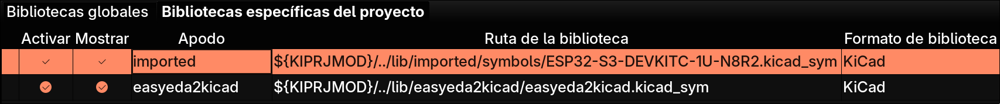

# kicadcomponent

Importa y elimina componentes de **LCSC / EasyEDA** en un proyecto **KiCad**,
manteniendo en sintonía las tres piezas que los componen: símbolo, footprint y
modelo 3D.

La importación la hace [`easyeda2kicad`](https://pypi.org/project/easyeda2kicad/).
Lo que añade `kicadcomponent` es lo que le falta: **saber deshacerla**, y no
tener que decirle a mano dónde está tu proyecto.

```console
$ kicadcomponent add C352847
$ kicadcomponent list
$ kicadcomponent remove C352847
```

## El problema que resuelve

Un componente se reparte en tres ficheros y **ninguno se llama como el LCSC ID**:

```
C352847  →  símbolo    LM324N_NOPB
         →  footprint  PDIP-14_L19.7-W6.6-P2.54-LS8.3-BL
         →  modelo 3D  PDIP-14_L19.7-W6.6-H5.1-P2.54-LS8.3-BL   (.wrl + .step)
```

El nombre del modelo 3D ni siquiera coincide con el del footprint. Borrarlo a
mano implica encontrar los tres y acordarse de que puede haber otros componentes
usando el mismo footprint.

No hace falta llevar una base de datos aparte, porque **la cadena entera ya está
escrita en los propios ficheros de la librería** — un índice paralelo sólo
podría desincronizarse:

| Relación | Dónde está guardada |
|---|---|
| LCSC → símbolo | `easyeda2kicad.kicad_sym` → `(property "LCSC Part" "C352847")` |
| símbolo → footprint | el mismo bloque → `(property "Footprint" "easyeda2kicad:PDIP-14_…")` |
| footprint → modelo 3D | `easyeda2kicad.pretty/<fp>.kicad_mod` → `(model "…/MODELO.wrl")` |

## Instalación

`kicadcomponent` es una herramienta de línea de comandos, así que lo suyo es
instalarla en su propio entorno aislado y que quede en el `PATH`.

```console
$ python -m venv .venv
$ pip install kicadcomponent && kicadcomponent --version
```

### Requisitos

Python ≥ 3.9 y nada más. `easyeda2kicad` entra como dependencia, así que **no
hay que instalarlo aparte ni activar ningún entorno** para usarlo:
`kicadcomponent` lo llama importándolo, no lanzando otro proceso. Funciona igual
en Linux, macOS y Windows.

## Uso

La ubicación que se busca por defecto para el nomrbe de la librería es `easyeda2kicad`, esto es porque si hay otras librerías, esta tiene preferencia, y si no existe se le tiene que indicar con la opción `--nickname`.

**IMPORTANTE** Las librerías deben estar en las rutas de kicad, si no no serán detectadas.



Estando en la ubicación del proyecto (donde esté el `.kicad_pro`), con `--project` se pueden usar estos comandos.

```
kicadcomponent [add|remove|rm|list|ls|where] [opciones]
```

### Comandos

| Comando | Qué hace |
|---|---|
| `kicadcomponent` | Imprime la ayuda |
| `kicadcomponent --help` | Ayuda general |
| `kicadcomponent --version` | Versión instalada |
| `kicadcomponent C352847` | Lo mismo: `add` es el subcomando por defecto, descarga todo |
| `kicadcomponent add --help` | Ayuda de un subcomando (igual para `remove`, `list`, `where`) |
| `kicadcomponent add C352847` | Importa el componente entero: símbolo + footprint + modelo 3D |
| `kicadcomponent add C352847 C25804` | Varios de una vez; sigue con los demás aunque uno falle |
| `kicadcomponent add --symbol C352847` | Sólo el símbolo |
| `kicadcomponent add --footprint C352847` | Sólo el footprint |
| `kicadcomponent add --3d C352847` | Sólo el modelo 3D |
| `kicadcomponent add --mode symbol C352847` | Forma larga de las tres anteriores: `full`, `symbol`, `footprint`, `3d` |
| `kicadcomponent add --no-overwrite C352847` | No reimporta encima de lo que ya exista |
| `kicadcomponent list` | Inventario de la librería, en una tabla |
| `kicadcomponent ls` | Alias de `list` |
| `kicadcomponent remove C352847` | Borra la cadena entera: enseña el plan y pide confirmación |
| `kicadcomponent remove LM324N_NOPB` | También busca por nombre de símbolo, exacto o parcial |
| `kicadcomponent rm C352847` | Alias de `remove` |
| `kicadcomponent rm -n C352847` | `--dry-run`: enseña el plan y sale sin tocar nada |
| `kicadcomponent rm -y C352847` | `--yes`: no pregunta, para guiones |
| `kicadcomponent where` | Enseña qué rutas está usando |

### Opciones comunes

Las aceptan los cuatro subcomandos, y van **después** del subcomando:

| Opción | Qué hace |
|---|---|
| `--project DIR` | Carpeta que contiene el `.kicad_pro`, si no estás dentro o hay varias |
| `--lib DIR` | Carpeta de la librería, saltándose las lib-tables |
| `--nickname NOMBRE` | Nombre de la librería, si no es `easyeda2kicad` |

Tres detalles que evitan sorpresas:

- Las opciones comunes van **después** del subcomando: `kicadcomponent list --project ~/x`, no al revés.
- Con el atajo sin `add`, las opciones van **después** del LCSC ID: `kicadcomponent C352847 --3d`.
- En la **primera** importación de un proyecto que aún no declara la librería hay que indicar dónde va con `--lib`.

### Ejemplo

```console
$ cd ~/Instrumentacion/CircuitoV5
$ kicadcomponent where
  proyecto   /home/carlos/Instrumentacion/CircuitoV5
  nickname   easyeda2kicad
  simbolos   /home/carlos/Instrumentacion/lib/easyeda2kicad/easyeda2kicad.kicad_sym
  footprints /home/carlos/Instrumentacion/lib/easyeda2kicad/easyeda2kicad.pretty
  modelos 3D /home/carlos/Instrumentacion/lib/easyeda2kicad/easyeda2kicad.3dshapes

$ kicadcomponent list
LCSC     SIMBOLO         FOOTPRINT                          MODELO 3D
-------  --------------  ---------------------------------  --------------------------------------
C25744   0402WGF1002TCE  R0402                              R0402_L1.0-W0.5-H0.4
C25804   0603WAF1002T5E  R0603                              R0603
C352847  LM324N_NOPB     PDIP-14_L19.7-W6.6-P2.54-LS8.3-BL  PDIP-14_L19.7-W6.6-H5.1-P2.54-LS8.3-BL

3 componentes en /home/carlos/Instrumentacion/lib/easyeda2kicad

$ kicadcomponent remove C352847
Se va a borrar de /home/carlos/Instrumentacion/lib/easyeda2kicad:
  simbolo    LM324N_NOPB  (C352847)
  fichero    …/easyeda2kicad.pretty/PDIP-14_L19.7-W6.6-P2.54-LS8.3-BL.kicad_mod
  fichero    …/easyeda2kicad.3dshapes/PDIP-14_L19.7-W6.6-H5.1-P2.54-LS8.3-BL.wrl
  fichero    …/easyeda2kicad.3dshapes/PDIP-14_L19.7-W6.6-H5.1-P2.54-LS8.3-BL.step
Confirmas el borrado? [y/N] y
  simbolo borrado (copia en …/easyeda2kicad.kicad_sym.bak)
  borrado …/easyeda2kicad.pretty/PDIP-14_L19.7-W6.6-P2.54-LS8.3-BL.kicad_mod
  borrado …/easyeda2kicad.3dshapes/PDIP-14_L19.7-W6.6-H5.1-P2.54-LS8.3-BL.wrl
  borrado …/easyeda2kicad.3dshapes/PDIP-14_L19.7-W6.6-H5.1-P2.54-LS8.3-BL.step
Refresca las librerias en KiCad para que deje de verlo.
```

Nunca borra lo que siga en uso. Si el footprint o el modelo 3D los comparte otro
componente, se quedan y se explica por qué:

```console
$ kicadcomponent rm -n C25804
Se va a borrar de /home/carlos/Instrumentacion/lib/easyeda2kicad:
  simbolo    0603WAF1002T5E  (C25804)
  fichero    (ninguno)
  nota: el footprint se conserva, lo usan tambien: 0603WAF1001T5E
  nota: el modelo 3D se conserva, lo sigue usando R0603
(--dry-run: no se ha tocado nada)
```

Además, el `.kicad_sym` se copia a `.kicad_sym.bak` antes de cada borrado.

## Cómo encuentra el proyecto y la librería

No hay rutas que configurar:

1. **El proyecto.** Sube desde el directorio actual hasta dar con un
   `.kicad_pro`. Si no aparece por encima, lo busca por debajo (hasta tres
   niveles), porque es habitual estar en la raíz del repositorio con los
   proyectos en subcarpetas. Si hay más de uno, se planta y pide un `--project`.
2. **La librería.** A partir del proyecto lee `sym-lib-table` y `fp-lib-table`,
   que es donde KiCad guarda de verdad dónde vive cada librería, y resuelve el
   `${KIPRJMOD}` (y cualquier otra variable de entorno) de la URI. Si sólo una de
   las dos tablas la declara, la otra se deduce a su lado; los modelos 3D se
   buscan siempre en el `.3dshapes` junto al `.pretty`.

Eso importa porque **la librería no tiene por qué estar dentro de la carpeta del
proyecto**. Este montaje, con dos revisiones compartiendo una librería, se
resuelve solo desde cualquiera de las tres carpetas:

```
Instrumentacion/
├── lib/easyeda2kicad/        ← la librería, compartida
├── v1/circuito.kicad_pro     ← ${KIPRJMOD}/../lib/easyeda2kicad/…
└── v2/circuito.kicad_pro
```

## Detalles de implementación

Los ficheros de KiCad se leen con un lector de s-expressions propio (sólo
biblioteca estándar) y no con expresiones regulares, porque en un mismo
`.kicad_sym` conviven dos estilos de escritura:

```lisp
; easyeda2kicad            ; KiCad al guardar desde su editor
(property                  (property "Reference" "R"
  "Reference"
  "R"
```

Y porque la ruta del `(model …)` puede venir de otra máquina
(`/home/otro/Documentos/…`), de modo que sólo es fiable el nombre del fichero.

## Licencia

MIT
